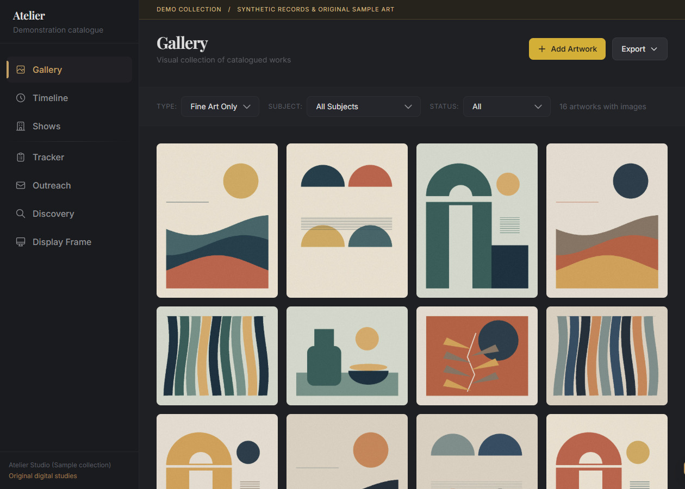
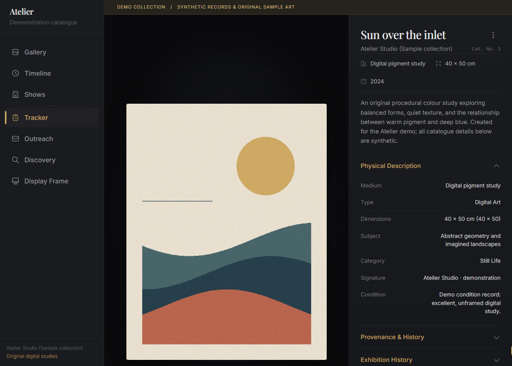
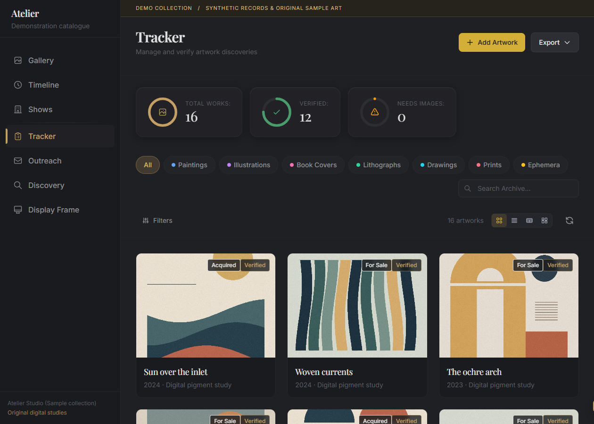
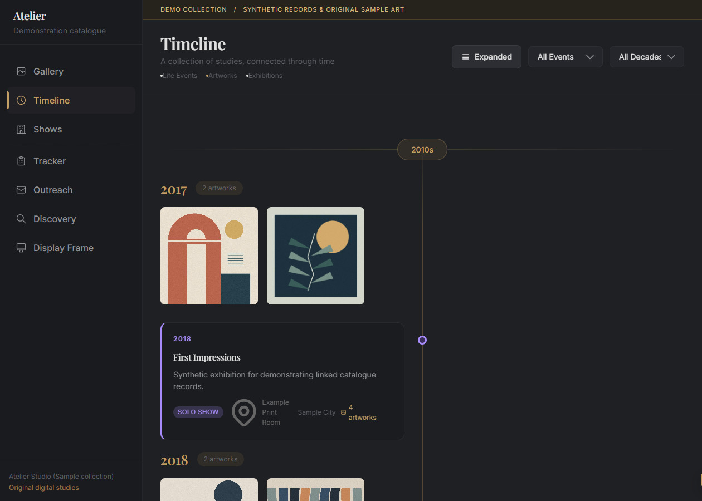
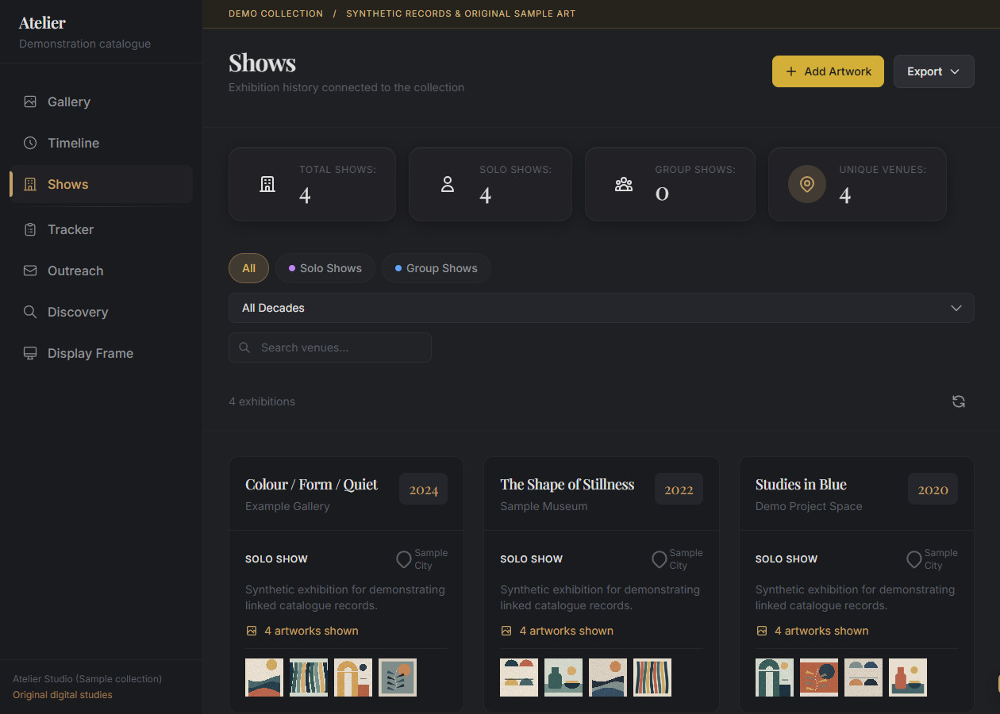
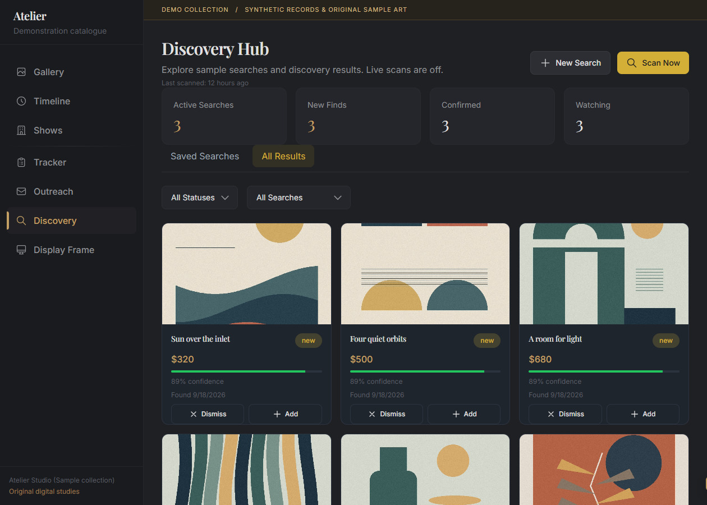
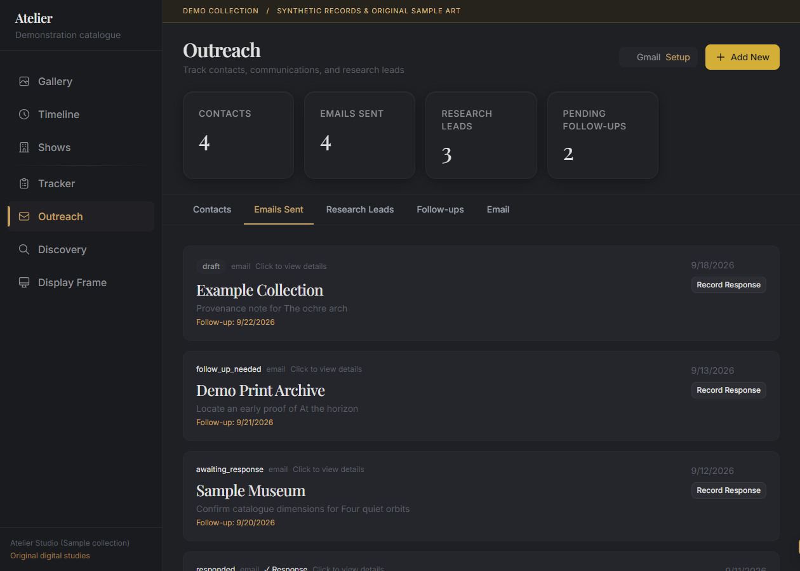
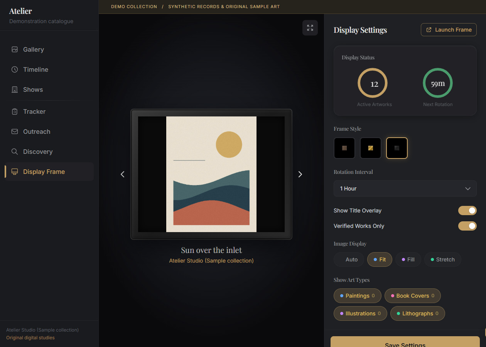
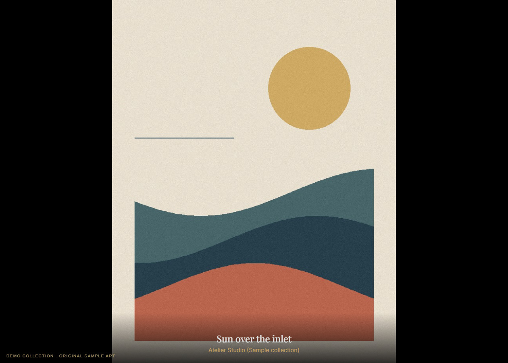

# Walk through Atelier

These are fresh captures of the running application using its included synthetic demo. Launch it with `python scripts/run_demo.py` after installing the project, then open <http://127.0.0.1:8779/?tab=gallery>. Use the Python interpreter from your virtual environment; see the [README](../README.md#try-the-populated-demo) for platform-specific commands.

## Gallery

Browse the collection visually and filter by type, subject, or verification state. Selecting an image opens the lightbox; the tracker also links to each work's detailed record.

## Artwork detail

The image sits beside the work's physical description. Expand the sections for provenance, exhibitions, acquisition status, source information, and notes.

## Tracker

Review discoveries, verify candidate records, and track acquisition status. Choose a card, compact, table, or masonry layout according to the task.

## Timeline and exhibitions

The timeline connects works and exhibitions by year. Shows collect venue details, dates, and the linked works' images.

## Discovery

Saved searches organize a review queue. The demo includes sample results with prices, confidence scores, and review states. These are fictional listings; **the demo does not run marketplace searches**. Normal discovery integrations need separate setup and credentials where required.

## Outreach

Contacts, correspondence records, research leads, and follow-ups share one workspace. These demo records use example-domain addresses and invented organizations. Gmail remains disconnected and sending is blocked in demo mode.

## Display

Choose a frame style, rotation interval, image fit, and the records to display. Launch the full-screen frame page in a browser or on an optional kiosk display.

## About the sample collection

The demo generator makes original geometric colour studies locally with Pillow. Titles, dates, prices, venues, attribution/verification states, and correspondence are synthetic, not claims about a real artist or transaction. The demo has its own database under ignored `local/demo/`; ordinary installations remain empty until you add records.

[Image provenance and promotional downloads](images/README.md) · [Setup and development](DEVELOPMENT.md) · [Optional display hardware](../display/hardware/README.md)
